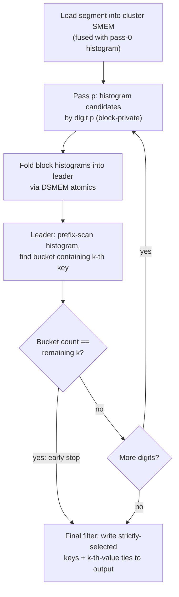

# Review Guide — PR #9224: Segmented Top-K using Thread-Block Clusters

**PR:** [NVIDIA/cccl#9224](https://github.com/NVIDIA/cccl/pull/9224) (closes [#9077](https://github.com/NVIDIA/cccl/issues/9077); related [#9075](https://github.com/NVIDIA/cccl/issues/9075), [#8360](https://github.com/NVIDIA/cccl/issues/8360), [#9259](https://github.com/NVIDIA/cccl/issues/9259)) · **Branch:** `cluster-topk-poc` · **Diff:** ~8,300 insertions / ~480 deletions across 29 files

This document is a reading companion for reviewers. It starts with a high-level overview and then dives into each layer of the change, with code excerpts, worked examples, diagrams, and clickable file links.

---

## Table of contents

1. [Executive summary](#1-executive-summary)
2. [Background: the problem and the hardware features used](#2-background)
3. [The algorithm at a glance (with a worked example)](#3-the-algorithm-at-a-glance)
4. [Code map](#4-code-map)
5. [Public API: `cub::DeviceBatchedTopK`](#5-public-api)
6. [Tuning & backend selection](#6-tuning--backend-selection)
7. [Host dispatch: wave-aware cluster sizing](#7-host-dispatch)
8. [Kernel layer: one symbol, two backends](#8-kernel-layer)
9. [Deep dive: the cluster agent](#9-deep-dive-the-cluster-agent)
10. [Supporting infrastructure changes](#10-supporting-infrastructure-changes)
11. [Tests](#11-tests)
12. [Benchmarks](#12-benchmarks)
13. [Suggested review focus areas](#13-suggested-review-focus-areas)
14. [Glossary & references](#14-glossary--references)

---

## 1. Executive summary

`cub::DeviceBatchedTopK` finds, independently for each of many segments, the K largest (or smallest) keys. Before this PR, the only backend was the **baseline**: one thread block ("worker") per segment, which caps the segment size at what a single block can tile (≤ 16 K keys with the largest worker policy) and cannot provide deterministic results.

This PR adds a second backend built on **thread-block clusters** (SM 9.0+ / Hopper), where **one cluster of up to 16 CTAs cooperatively processes one segment**, communicating through **distributed shared memory (DSMEM)** instead of global memory. That buys three things:

1. **Larger segments** — up to 2²¹ (~2 M) keys per segment, held resident across the cluster's combined shared memory (with a gmem re-streaming fallback beyond that).
2. **Determinism and tie-breaking** — the new backend implements `determinism::run_to_run`, `determinism::gpu_to_gpu`, and index-based tie-breaks (`prefer_smaller_index` / `prefer_larger_index`), which the baseline cannot.
3. **Speed** — a single fused kernel replaces what would otherwise be a multi-kernel / global-histogram pipeline (as used by `cub::DeviceTopK`): the radix histogram, splitter search, and final filter all happen inside one persistent cluster with no global-memory round trips for intermediate state.

Both backends are launched through a **single kernel symbol**; the backend is chosen per architecture at compile time (device side) and per request at dispatch time (host side): deterministic requests → cluster; segments too large for the baseline → cluster; otherwise an architecture/size crossover (cluster only wins on SM 10.0+/B200 for segments ≥ 8 Ki).

The bulk of the new code (~3,000 lines) is the cluster agent [`cub/cub/agent/agent_batched_topk_cluster.cuh`](cub/cub/agent/agent_batched_topk_cluster.cuh), which is written with unusual attention to codegen (raw PTX for barriers/atomics, TMA bulk copies, 32-bit shared-memory addressing) — Section 9 explains each of those choices.

---

## 2. Background

### 2.1 The problem

Given `num_segments` independent arrays ("segments") of keys and a per-segment `k`, output each segment's top-k. This is the batched/segmented form of top-k that dominates workloads like LLM decoding (top-k sampling per batch row), beam search, and vector-search shortlists — many medium-sized independent problems rather than one huge one. A single-segment `cub::DeviceTopK` launch per segment wastes the GPU (a 512 K-element segment can't fill an H100 alone, and kernel-launch overhead dominates for thousands of small segments).

### 2.2 Thread-block clusters and DSMEM (the enabling hardware)

Hopper (SM 9.0) introduced an optional level between block and grid: the **thread block cluster**. Blocks of a cluster are co-scheduled on one GPC and can **read, write, and perform atomics on each other's shared memory** — *distributed shared memory* (DSMEM) — and synchronize with a hardware cluster barrier. Key facts used by this PR (see the [Hopper Tuning Guide](https://docs.nvidia.com/cuda/hopper-tuning-guide/index.html) and [CUDA Programming Guide — Thread Block Clusters](https://docs.nvidia.com/cuda/cuda-c-programming-guide/index.html#thread-block-clusters)):

- The **portable** maximum cluster width is **8** blocks; H100 supports **16** by opting in via `cudaFuncAttributeNonPortableClusterSizeAllowed`. The PR encodes both as constants: [`util_device.cuh:603-608`](cub/cub/util_device.cuh#L603-L608).
- DSMEM traffic runs on the SM-to-SM network and can be used *simultaneously with* L2 — a cluster-based algorithm gets the combined bandwidth of both.
- PTX exposes cluster machinery directly: `mapa` (map a shared address to a peer CTA's window), `barrier.cluster.arrive/wait` (split cluster barrier), `red.relaxed.cluster.shared::cluster` (DSMEM atomics), and `%cluster_ctarank` special registers. The agent uses these raw instead of cooperative groups (see §9.9).

Why clusters fit top-k: the radix top-k algorithm needs a **global histogram per pass**. Multi-block implementations traditionally accumulate it in global memory across kernel launches. A cluster keeps the histogram in the leader block's shared memory and lets every other block **fold its counts in via DSMEM atomics** — no gmem round trip, no kernel relaunch, and the keys stay cached in each block's SMEM across all passes.

### 2.3 TMA bulk copies

The agent loads keys from gmem into SMEM using `cp.async.bulk` (the Tensor Memory Accelerator path, issued by one elected thread, completion tracked by an `mbarrier` with a transaction count). This gives near-peak load bandwidth with almost no register/instruction cost, but requires **16-byte-aligned** transfers — which is why the agent has an elaborate chunk-alignment scheme (§9.2).

---

## 3. The algorithm at a glance

The core is a **radix-select** (a.k.a. AIR-Top-K-style) algorithm, the same family as `cub::DeviceTopK`: instead of sorting, repeatedly histogram the keys by their next `bits_per_pass`-bit digit and narrow the "splitter" (the k-th key) one digit at a time.



### Worked example

Take one segment of 8-bit keys, `bits_per_pass = 4` (16 buckets, 2 passes), **MaxKeys**, `k = 3`:

```
keys  = [201, 17, 91, 240, 33, 201, 100, 6]
hex   = [ C9, 11, 5B,  F0, 21,  C9,  64, 06]
```

**Pass 0** histograms the high nibble. Scanning buckets from the top (max selection):

| bucket (hi nibble) | F | C | 6 | 5 | 2 | 1 | 0 |
|---|---|---|---|---|---|---|---|
| count | 1 | 2 | 1 | 1 | 1 | 1 | 1 |

- Bucket `F` holds 1 key (`240`) → 1 of 3 selected, `k_remaining = 2`.
- Bucket `C` holds 2 keys (`201, 201`); cumulative 3 ≥ k, so `C` is the **splitter bucket**.
- The bucket's count (2) **equals** `k_remaining` (2) → **early stop**: every key with prefix `C…` wins; no second pass needed. Output set: `{240, 201, 201}`.

Now the interesting case, `k = 2`: bucket `F` gives 1 winner, `k_remaining = 1`, but bucket `C` holds **2 candidates** — a tie at the k-th position. **Pass 1** histograms only keys with prefix `C` by their low nibble: both `201`s land in bucket `9`. After the last pass, `num_kth = 1` of the 2 tied candidates may be selected:

- `determinism::not_guaranteed` → whichever candidate's atomic lands first wins (fast, racing).
- `gpu_to_gpu` + `prefer_smaller_index` → the `201` at index 0 wins, deterministically, via an index-ordered cross-CTA scan (§9.7).

Two structural properties drive the whole implementation:

1. Only *candidates* (keys matching the splitter prefix so far) are histogrammed after pass 0 — the working set shrinks geometrically, so later passes are cheap. That is why keeping keys **resident in SMEM across passes** pays: passes 1+ re-read from SMEM, not gmem.
2. The final output = *strictly-selected* keys (better than the splitter — order among them free) + the first `num_kth` *ties* (equal to the splitter). Determinism only constrains **which ties** are chosen.

With the default tuning ([`tuning_batched_topk.cuh:295-309`](cub/cub/device/dispatch/tuning/tuning_batched_topk.cuh#L295-L309)): 512 threads/block, `bits_per_pass = 11` (2048 buckets) → **3 passes** for 32-bit keys, 6 for 64-bit; chunk size 16 KiB; 8-stage load pipeline; TMA load alignment 128 B.

---

## 4. Code map

| File | Δ | Role |
|---|---|---|
| [`cub/cub/agent/agent_batched_topk_cluster.cuh`](cub/cub/agent/agent_batched_topk_cluster.cuh) | **+2993 (new)** | The cluster agent — §9 |
| [`cub/cub/device/dispatch/dispatch_batched_topk.cuh`](cub/cub/device/dispatch/dispatch_batched_topk.cuh) | +928 | Unified dispatch; wave-aware cluster launch — §7 |
| [`cub/cub/device/dispatch/tuning/tuning_batched_topk.cuh`](cub/cub/device/dispatch/tuning/tuning_batched_topk.cuh) | +476 | `cluster_topk_policy`, backend selector — §6 |
| [`cub/cub/device/dispatch/kernels/kernel_batched_topk.cuh`](cub/cub/device/dispatch/kernels/kernel_batched_topk.cuh) | +376 | Single kernel symbol, CDP kernel — §8 |
| [`cub/cub/device/device_batched_topk.cuh`](cub/cub/device/device_batched_topk.cuh) | +334 | Public API, compile-time validation — §5 |
| [`cub/cub/detail/segmented_params.cuh`](cub/cub/detail/segmented_params.cuh) | +73 | `get_segment_size` clamping, deferred-handle checks — §10 |
| [`cub/cub/detail/launcher/cuda_runtime.cuh`](cub/cub/detail/launcher/cuda_runtime.cuh) | +38 | Cluster-occupancy query wrappers — §10 |
| [`thrust/.../triple_chevron_launch.h`](thrust/thrust/system/cuda/detail/core/triple_chevron_launch.h) | +48 | Cluster-dimension launches via `cudaLaunchKernelEx` — §10 |
| [`cub/cub/util_device.cuh`](cub/cub/util_device.cuh) | +8 | Cluster-width constants — §10 |
| [`cub/cub/agent/agent_batched_topk.cuh`](cub/cub/agent/agent_batched_topk.cuh) | +12 | Baseline agent: negative-size clamp, `k == 0` skip |
| `cub/test/…` (6 files, 1 new + 1 new xfail) | +2400 | §11 |
| `cub/benchmarks/bench/segmented_topk/…` (2 new TUs + 2 new headers) | +1050 | §12 |
| [`docs/cub/api_docs/device_topk_requirements.rst`](docs/cub/api_docs/device_topk_requirements.rst) | +38 | Documents the new per-arch support matrix |

---

## 5. Public API

Entry points: `cub::DeviceBatchedTopK::{Max,Min}{Keys,Pairs}` in [`device_batched_topk.cuh`](cub/cub/device/device_batched_topk.cuh), each in a classic temp-storage form and an env-based form that allocates internally. Inputs are **iterators of iterators**: `d_keys_in[s]` yields the iterator for segment `s`, so segments need not be contiguous or uniformly strided.

### 5.1 Usage example (from the doc-embedded test, [`catch2_test_device_batched_topk_api.cu:30-76`](cub/test/catch2_test_device_batched_topk_api.cu#L30-L76))

```c++
constexpr int num_segments = 2, segment_size = 8, k = 3;
auto keys_in  = thrust::device_vector<int>{5, -3, 1, 7, 8, 2, 4, 6, /**/ 0, 9, 3, 2, 1, 8, 7, 4};
auto keys_out = thrust::device_vector<int>(num_segments * k, thrust::no_init);

// d_keys_in[s] yields an iterator to the start of segment s.
auto d_keys_in  = cuda::make_strided_iterator(
    cuda::make_counting_iterator(thrust::raw_pointer_cast(keys_in.data())), segment_size);
auto d_keys_out = cuda::make_strided_iterator(
    cuda::make_counting_iterator(thrust::raw_pointer_cast(keys_out.data())), k);

// Argument annotations: compile-time segment size and k.
constexpr auto segment_sizes = cuda::args::constant<segment_size>{};
constexpr auto k_arg         = cuda::args::constant<k>{};

// The unordered / possibly-non-deterministic contract must be acknowledged explicitly.
auto env = cuda::std::execution::env{cuda::execution::require(
    cuda::execution::determinism::not_guaranteed,
    cuda::execution::tie_break::unspecified,
    cuda::execution::output_ordering::unsorted)};

cub::DeviceBatchedTopK::MaxKeys(d_temp, temp_bytes, d_keys_in, d_keys_out,
                                segment_sizes, k_arg, cuda::args::immediate{int64_t{num_segments}}, env);
// Result (per segment, unspecified order): {8,7,6} and {9,8,7}.
```

### 5.2 The `cuda::args` annotation framework

`segment_sizes`, `k`, and `num_segments` are **annotated arguments**: the annotation says where the value comes from *and* how tightly it is bounded, and the kernel specializes on both:

| Form | Meaning |
|---|---|
| `cuda::args::constant<N>{}` | compile-time value (also its own bound) |
| `cuda::args::immediate{v}` | host-known value at call time |
| `cuda::args::deferred{ptr}` | single value read on the device in stream order |
| `cuda::args::deferred_sequence{it}` | per-segment values, indexed on the device |

plus optional compile-time (`bounds<lo,hi>()`) and runtime (`bounds(lo,hi)`) bounds. This matters concretely: the static max segment size selects the backend, sizes the launch, clamps loop unrolls, and (on the baseline) selects the worker tile. That is why the docs push hard for **tight upper bounds**, and why an un-annotated `int` segment size is a *compile error* (its type-max 2³¹ exceeds the supported 2²¹).

### 5.3 The execution-requirements contract

The result is governed by two orthogonal requirements (see the reasoning comment at [`device_batched_topk.cuh:79-94`](cub/cub/device/device_batched_topk.cuh#L79-L94)): *which* items are selected (`determinism`, refined by `tie_break`) and *how* they are written (`output_ordering`). The committed long-term default is the most reproducible contract (`gpu_to_gpu` + `prefer_smaller_index` + `stable_sorted`); since sorted output is not yet implemented, **an empty environment is rejected at compile time** and callers must explicitly request `unsorted`. Three rules are enforced by layered `static_assert`s:

1. `determinism` and `tie_break` must be specified together or omitted together.
2. A concrete tie-break (`prefer_{smaller,larger}_index`) pins the result set exactly, so it requires `gpu_to_gpu`.
3. Only `output_ordering::unsorted` is implemented.

This admits exactly five `(determinism, tie_break)` pairs: `(not_guaranteed, unspecified)`, `(run_to_run, unspecified)`, `(gpu_to_gpu, {unspecified, prefer_smaller_index, prefer_larger_index})`. Anything deterministic requires SM 9.0+ (the cluster backend).

A notable design detail: every constraint is checked *here*, at the call site, with one targeted diagnostic per misuse; the dispatch is only instantiated once all checks pass ([`device_batched_topk.cuh:243-278`](cub/cub/device/device_batched_topk.cuh#L243-L278)), preventing the usual cascade of template errors. The `static_assert`s are guarded so each misuse trips only its own message — e.g. a raw pointer passed as `segment_sizes` reports "wrap it in `deferred_sequence`", not five follow-on errors. The 14-variant xfail test in §11 pins each of these messages.

### 5.4 Compile-time limits

- **Max segment size 2²¹ (~2 M keys)** ([`device_batched_topk.cuh:216-231`](cub/cub/device/device_batched_topk.cuh#L216-L231)). Rationale: beyond that the streaming cluster backend stops being competitive; a multi-CTA baseline for huge segments is future work. Also, internal offsets are `uint32_t` and the cross-CTA scan packs two counts into one `uint64_t` (§9.6), which needs 32-bit lanes.
- **Negative sizes are tolerated**: a statically-possible-negative lower bound is accepted and negative runtime sizes clamp to an empty segment (`detail::params::get_segment_size`, §10).

---

## 6. Tuning & backend selection

All in [`tuning_batched_topk.cuh`](cub/cub/device/dispatch/tuning/tuning_batched_topk.cuh). The combined policy is a plain value type:

```c++
struct topk_policy {
  topk_backend backend;          // baseline | cluster | unsupported
  baseline_topk_policy baseline; // worker-per-segment sub-policy (pre-existing)
  cluster_topk_policy cluster;   // new sub-policy (below)
};
```

### 6.1 The cluster sub-policy ([`tuning_batched_topk.cuh:230-309`](cub/cub/device/dispatch/tuning/tuning_batched_topk.cuh#L230-L309))

| Knob | Default | What it controls |
|---|---|---|
| `threads_per_block` | 512 | CTA width |
| `min_blocks_per_sm` | 1 | `__launch_bounds__` occupancy hint |
| `min_chunks_per_block` | 1 | a CTA joins a segment's *effective* cluster only if it owns ≥ this many chunks |
| `chunk_bytes` | 16 KiB | granularity of the SMEM load pipeline (one chunk = one slot) |
| `load_align_bytes` | 128 | TMA transfer alignment (power of two, ≥ 16) |
| `pipeline_stages` | 8 | depth of the async-copy mbarrier pipeline |
| `single_block_max_seg_size` | 8 Ki | largest segment still taking the barrier-free single-CTA path |
| `bits_per_pass` | 11 | radix digit width → 2048 buckets, 3 passes for 32-bit keys |
| `histogram / tie_break / copy_items_per_thread` | 8 / 8 / 8 | per-thread unrolls of the three hot loops |

Notably, the **cluster width and dynamic-SMEM size are *not* policy fields** — they are computed at dispatch time per launch (§7), because the right answer depends on the runtime segment-size bound and device occupancy.

### 6.2 Backend decision

`policy_selector::operator()(cc)` ([`tuning_batched_topk.cuh:437-478`](cub/cub/device/dispatch/tuning/tuning_batched_topk.cuh#L437-L478)) applies, in order:

```
force_cluster        → cluster if cc ≥ 9.0 else unsupported
force_baseline       → baseline if (coverable ∧ non-deterministic) else unsupported
deterministic request→ cluster if cc ≥ 9.0 else unsupported
!baseline_can_cover  → cluster if cc ≥ 9.0 else unsupported   (segment too big for one block)
otherwise            → cluster iff cc ≥ 10.0 ∧ static_max_seg ≥ 8 Ki, else baseline
```

The last line is the empirical **crossover**: on B200 measurements, the cluster backend only consistently beats the baseline at SM 10.0+ and for segments ≥ 8 Ki ([`tuning_batched_topk.cuh:400-408`](cub/cub/device/dispatch/tuning/tuning_batched_topk.cuh#L400-L408)). The crossover constants are deliberately part of the *selector*, not the tunable policy, so tuning cluster knobs can never silently shift which backend runs.

Two adaptors round this out: `selector_override_adaptor` lets a `cuda::execution::tune(...)` selector pin backend + knobs in one shot but **rejects** (maps to `unsupported`) an override that can't serve the request — e.g. baseline for a deterministic request — rather than silently rerouting; `baseline_policy_selector_adaptor` projects the combined policy down for the baseline machinery.

### 6.3 Unsupported-architecture handling

If any architecture in `CMAKE_CUDA_ARCHITECTURES` resolves to `unsupported` (e.g. deterministic request while sm_75 is in the fatbin list), the dispatch **fails at compile time** by default ([`dispatch_batched_topk.cuh:1191-1205`](cub/cub/device/dispatch/dispatch_batched_topk.cuh#L1191-L1205)) — the least surprising behavior for the default multi-arch preset. Defining `_CUB_DISABLE_TOPK_UNSUPPORTED_ARCH_ASSERT` defers to a runtime `cudaErrorNotSupported`; CUB's own tests/benchmarks do that so one binary can cover the full config space and skip at runtime.

---

## 7. Host dispatch

[`dispatch_batched_topk.cuh`](cub/cub/device/dispatch/dispatch_batched_topk.cuh). The unified `dispatch(...)` ([`:1127`](cub/cub/device/dispatch/dispatch_batched_topk.cuh#L1127)) resolves the device's compute capability, asks the selector for the per-CC policy, and branches into `launch_baseline_arm` or `launch_cluster_arm` — both launching the *same* kernel symbol.

### 7.1 The cluster arm's launch-geometry problem

The launch shape has two coupled free variables: **cluster width `C`** (blocks per segment; the grid is `num_segments × C` blocks, one cluster per segment) and **dynamic SMEM per block** (which determines how many keys stay resident per CTA). They trade off:

- smaller `C` → each CTA must hold more of the segment → more SMEM → fewer clusters resident per wave;
- larger `C` → less SMEM each → more clusters per wave, more L1 → but more cluster-barrier overhead.

The dispatch solves this **wave-aware** ([`dispatch_batched_topk.cuh:678-810`](cub/cub/device/dispatch/dispatch_batched_topk.cuh#L678-L810)): for each candidate `C` it computes the minimal chunk-granular SMEM `S_res(ceil(seg/C))` that keeps the segment fully resident, probes `cudaOccupancyMaxActiveClusters` for device-wide clusters-per-wave at that config, and picks the `C` minimizing `waves = ceil(num_segments / clusters_per_wave)`, tie-breaking toward the **largest** `C` (least SMEM → most L1), which matched the profiled fast configs. Enumerating `C` analytically (rather than discovering SMEM tiers via occupancy) avoids a subtle failure: register-limited occupancy could otherwise collapse the candidate set.

**Worked example** (H100, `float` keys, uniform `seg = 524,288`, defaults: chunk = 16 KiB = 4096 floats, opt-in SMEM ≈ 227 KiB → 14 slots → per-CTA capacity 57,344 keys):

- `C_lo = ceil(524288 / 57344) = 10` — fewest CTAs that keep the segment resident.
- `C_full = min(16, ceil(524288 / 4096)) = 16` — hardware cap.
- Scan `C ∈ [10, 16]`; for each, SMEM shrinks (`C=10` → 13 slots ≈ 208 KiB; `C=16` → 8 slots = 128 KiB + padding), occupancy grows; pick min-waves, largest-`C` on ties.

Three special cases bracket the scan:

1. **Single-CTA fast path** ([`:717-726`](cub/cub/device/dispatch/dispatch_batched_topk.cuh#L717-L726)): segment fits one CTA's SMEM *and* is ≤ `single_block_max_seg_size` (8 Ki) → launch `C = 1` clusters; the agent then runs entirely barrier-free (§9.8).
2. **Oversize** (`C_lo > 16`): full residency impossible → largest launchable cluster at max SMEM; the agent **re-streams** overflow chunks from gmem/L2 each pass (§9.4).
3. All 64-bit sizing math guards against a *loose* bound (e.g. `numeric_limits::max()` for an unbounded `deferred_sequence`) wrapping `int` and silently entering the wrong branch ([`:700-712`](cub/cub/device/dispatch/dispatch_batched_topk.cuh#L700-L712)).

Notable subtleties reviewers should check:

- **SMEM budget math** ([`:626-675`](cub/cub/device/dispatch/dispatch_batched_topk.cuh#L626-L675)): the dynamic budget = `cudaDevAttrMaxSharedMemoryPerBlockOptin` − driver-reported `sharedSizeBytes` (padding-aware static footprint from `cudaFuncGetAttributes`, deliberately *not* `sizeof(TempStorage)`). The comment also notes opt-in already excludes the per-block reserved SMEM — subtracting it again would double-count (there is a matching `TODO` fix-note on the pre-existing helper in [`util_device.cuh:499-500`](cub/cub/util_device.cuh#L499-L500)).
- `cudaFuncAttributeMaxDynamicSharedMemorySize` is raised **lazily and monotonically** (`ensure_dynamic_smem_limit`) so occupancy probes never request more than currently configured.
- **CDP path**: device-side launches can't opt into dynamic cluster dims or >48 KiB SMEM, so CDP uses a dedicated kernel with compile-time `__cluster_dims__(8,1,1)` and portable SMEM only; segments beyond portable resident coverage still work via streaming ([`:853-875`](cub/cub/device/dispatch/dispatch_batched_topk.cuh#L853-L875)).

### 7.2 The baseline arm

Essentially the previous `dispatch` body, now parameterized by the combined selector, with the legacy `baseline_dispatch` retained (temporarily) for the old entry points. When the selector's `baseline_can_cover` is false, the arm compiles to a stub returning `cudaErrorNotSupported`, keeping the whole baseline machinery **pruned per-arch** in AOT builds ([`:915-926`](cub/cub/device/dispatch/dispatch_batched_topk.cuh#L915-L926)).

---

## 8. Kernel layer

[`kernel_batched_topk.cuh`](cub/cub/device/dispatch/kernels/kernel_batched_topk.cuh) hosts **one kernel symbol for both backends**:

```c++
// kernel_batched_topk.cuh:330
_CCCL_KERNEL_ATTRIBUTES void device_batched_topk_kernel(..., baseline_kernel_args<...> base_args,
                                                        cluster_kernel_args clus_args)
{
  constexpr auto policy = current_policy<PolicySelector>();
  if constexpr (policy.backend == topk_backend::baseline)      { /* baseline agent */ }
  else if constexpr (policy.backend == topk_backend::cluster)  { NV_IF_TARGET(NV_PROVIDES_SM_90, (/* cluster agent */)) }
  else { return; } // unsupported: host never launches this arm
}
```

Why this shape: the backend choice is per *architecture* (evaluated per `__CUDA_ARCH__` pass), so each arch in a fatbin compiles **only** its selected arm — honoring CUB's "one kernel per arch/problem" rule while letting sm_90 pick cluster and sm_80 pick baseline in the same binary. The unused arm's arguments travel as a few null/zero grid-constant scalars ([`:222-235`](cub/cub/device/dispatch/kernels/kernel_batched_topk.cuh#L222-L235)). Because the two backends need different `__launch_bounds__` shapes, consteval helpers resolve threads-per-block and min-blocks-per-SM from the selected arm ([`:244-290`](cub/cub/device/dispatch/kernels/kernel_batched_topk.cuh#L244-L290)).

One low-level nugget: the dynamic-SMEM base is rounded up to the slot alignment through a 32-bit shared address with an empty `asm("" : "+r"(smem32))` in between ([`:416-421`](cub/cub/device/dispatch/kernels/kernel_batched_topk.cuh#L416-L421)) — the asm is an optimization barrier that keeps the compiler from folding the alignment away, so every TMA destination provably carries the 128-byte alignment the gmem sources have.

---

## 9. Deep dive: the cluster agent

[`agent_batched_topk_cluster.cuh`](cub/cub/agent/agent_batched_topk_cluster.cuh) — the heart of the PR. One cluster processes one segment; `segment_id = blockIdx.x / cluster_blocks` ([`:2885-2896`](cub/cub/agent/agent_batched_topk_cluster.cuh#L2885-L2896)).

### 9.1 Memory layout

Every block of the cluster allocates the **identical** static `_TempStorage` layout, so any block can reach a peer's fields at a known offset via DSMEM ([`:397-415`](cub/cub/agent/agent_batched_topk_cluster.cuh#L397-L415)):

```
Static SMEM (_TempStorage, identical in every CTA)          Dynamic SMEM (key_slots)
┌──────────────────────────────────────────────┐            ┌────────────┬────────────┬─────┐
│ hist[2048]        per-pass radix histogram   │            │ chunk slot │ chunk slot │ ... │
│ state             len / k / result_pair      │◄─ leader's │ (16 KiB)   │ (16 KiB)   │     │
│                   copy = cluster state       │   is read  ├────────────┴────┬───────┴─────┤
│ prefix_pair (u64) cross-CTA scan accumulator │◄─ peers    │ resident region │ streaming   │
│ front/back_local_cnt, num_strictly_selected, │   red.add  │ slots [0, R)    │ slots [R,F) │
│ my_candidates     block-local counters       │   via DSMEM└─────────────────┴─────────────┘
│ scan_storage      cub::BlockScan             │
│ load_mbar[8]      one mbarrier per stage     │
│ edge_keys[2*32]   unaligned head + tail edges│
└──────────────────────────────────────────────┘
```

- `hist` plays a **dual role**: each block's private histogram during accumulation, then (in the leader only) the cluster-merged histogram after the DSMEM fold.
- `state.result_pair` packs the per-pass leader result — low 32 bits splitter bucket, high 32 bits early-stop flag — so every block pulls it in **one naturally-aligned 64-bit DSMEM load** instead of two ([`:96-115`](cub/cub/agent/agent_batched_topk_cluster.cuh#L96-L115)). The full splitter key is *never broadcast*: each block folds the published bucket digit into its own local `kth_key_bits_local` each pass.
- The dynamic region is carved into fixed 16 KiB **chunk slots** shared by the resident keys and the streaming pipeline (`smem_block_tile_layout`, [`:121-150`](cub/cub/agent/agent_batched_topk_cluster.cuh#L121-L150)); the host and device compute capacity from the same struct, so they can never disagree.

### 9.2 Chunking & alignment

TMA bulk copies need 16 B-aligned (here: 128 B, for peak throughput) transfers, but a segment's base pointer is arbitrary. The agent peels the misaligned boundaries into a tiny static-SMEM buffer and keeps everything else guard-free:

```
gmem segment:  [ head edge |ALIGNED| chunk 0 | chunk 1 | ... | chunk N-1 |ALIGNED| tail edge ]
                < 32 items    128B-aligned, whole 16-KiB chunks (last may be short)  < 32 items
                    │                                                                  │
                    └────────────► edge_keys[0..cap)          edge_keys[cap..2cap) ◄───┘
                                   (static SMEM, loaded once, folded into every pass)
```

- `aligned_head_items` computes the misaligned prefix; chunking starts at the first 128 B boundary ([`:437-455`](cub/cub/agent/agent_batched_topk_cluster.cuh#L437-L455)). Every chunk therefore starts aligned; only the global-last chunk can carry an unaligned suffix, which is always peeled.
- Edge staging **fuses copy and first-pass histogram** in one strided sweep — each thread folds exactly the keys it just wrote, so no barrier is needed *by construction* ([`stage_and_fold_edge`, `:560-581`](cub/cub/agent/agent_batched_topk_cluster.cuh#L560-L581)).
- Types that can't be tiled by bytes (e.g. `float3`: `sizeof != alignof` padding hazards) or non-contiguous iterators fall back to a **generic path** (`use_block_load_to_shared == false`) with plain per-element loads and no async pipeline ([`:360-371`](cub/cub/agent/agent_batched_topk_cluster.cuh#L360-L371)).

**Chunk→CTA partition** ([`make_chunk_partition`, `:542-558`](cub/cub/agent/agent_batched_topk_cluster.cuh#L542-L558)): *strided* (chunk `i` → rank `i % C`) by default; *blocked* (contiguous runs per rank) on the deterministic path, because the index-ordered tie-break scan requires CTA-rank order to match ascending global-index ranges.

### 9.3 The async load pipeline

A hand-rolled inline of `BlockLoadToShared`'s internals ([`:656-729`](cub/cub/agent/agent_batched_topk_cluster.cuh#L656-L729)): one mbarrier per stage, a single elected leader thread (`cuda::device::__block_elect_one()`, cached at construction) issues `cp.async.bulk` + `mbarrier_arrive_expect_tx`; all threads spin on `mbarrier_try_wait_parity`. The per-stage wait state is **one parity bit** in a per-thread 32-bit `load_phase` mask — deliberately no per-stage token array, so the pipeline loops spill nothing. The first-pass resident load is software-pipelined `PipelineStages` deep and *fused with the pass-0 histogram* (`load_and_histogram_first_pass`, [`:2087-2251`](cub/cub/agent/agent_batched_topk_cluster.cuh#L2087-L2251)): consume chunk `i` while chunks `i+1..i+8` are in flight.

A recurring safety comment worth understanding once: re-arming a stage's mbarrier before *all* threads have left its previous wait would advance the phase twice and strand a lagging waiter — hence the `__syncthreads()` before each re-issue ("phase safety, not data safety", [`:2182-2185`](cub/cub/agent/agent_batched_topk_cluster.cuh#L2182-L2185)).

### 9.4 The overflow streamer

When a CTA owns more chunks than its slots can hold (`my_chunks > full_slots`), it keeps the first chunks resident and **re-streams the overflow from gmem (effectively L2) every pass** through a small round-robin set of streaming slots at the tail of its block tile ([`overflow_streamer`, `:940-1240`](cub/cub/agent/agent_batched_topk_cluster.cuh#L940-L1240)). Two tricks:

- **Ping-pong order**: each pass walks the overflow in the direction opposite to the previous pass, so the last `eff_stages` chunks a pass leaves sitting in the streaming slots are exactly the *first* chunks the next pass needs — reused with no reload. A rank re-loads exactly `excess` chunks per pass, no more.
- **`mid()` overlap**: each pass first consumes the slots inherited from the previous pass (issuing this pass's reload wave into the freed slots), then runs the caller's *resident-chunk* work (`mid`) to hide those in-flight copies, then consumes the rest. The final filter can also **break the stream early** (`should_continue`) once the top-k is fully placed, draining in-flight copies before returning.

For the deterministic path, the initial direction is *preselected* so that after the compile-time number of passes the parity comes out forward for the straddling CTA's index-ordered scan ([`:2656-2665`](cub/cub/agent/agent_batched_topk_cluster.cuh#L2656-L2665)) — a subtle invariant guarded by an assert in `process_overflow`.

### 9.5 A radix pass, step by step

`run_radix_passes` ([`:2414-2619`](cub/cub/agent/agent_batched_topk_cluster.cuh#L2414-L2619)) implements the three-step histogram protocol from the file header:

```
   CTA 0 (non-leader)      CTA 1 (non-leader)        CTA L (leader)
   ┌───────────────┐       ┌───────────────┐       ┌───────────────┐
1. │ hist ← red.cta │       │ hist ← red.cta │       │ hist ← red.cluster │   block-private accumulation
   └──────┬────────┘       └──────┬────────┘       └───────▲───────┘
2.        └────── mapa + red.relaxed.cluster.shared::cluster ┘             DSMEM fold into leader
          (each non-leader adds its bucket counts into leader's hist)
3.        (non-leaders: scan OWN hist into registers, in the           ┌── leader: BlockScan merged hist,
           cluster-arrive→wait window)                                 │   find k-th bucket, publish
                                                                       ▼   state.result_pair
4. every block: one u64 DSMEM load of result_pair → fold digit into local splitter; uniform early-stop check
```

Step 1's atomics are scope-minimal: non-leaders use `red.relaxed.cta.shared::cta.add.u32` on their own histogram; only the leader must use **cluster** scope, to stay mutually atomic with the incoming Step-2 folds ([`hist_inc`, `:817-828`](cub/cub/agent/agent_batched_topk_cluster.cuh#L817-L828)). Step 2 forms the peer address with `mapa.shared::cluster.u32` — no 64-bit pointers involved ([`hist_fold_remote`, `:834-840`](cub/cub/agent/agent_batched_topk_cluster.cuh#L834-L840)).

**Latency hiding is the theme of the last commits** ("Improve latency hiding via split-barrier"). Every `cluster.sync()` is split into `barrier.cluster.arrive.release` + `barrier.cluster.wait.acquire` with independent block-local work in the window:

- The *initial* barrier arrives right after zeroing `state`/`hist` in `process_impl` and only waits in pass 0, so the **entire fused load+histogram overlaps cluster arrival** ([`:2975-2979`](cub/cub/agent/agent_batched_topk_cluster.cuh#L2975-L2979), [`:2506-2513`](cub/cub/agent/agent_batched_topk_cluster.cuh#L2506-L2513)).
- The *post-fold* barrier's window hosts the non-leaders' own-histogram scan (Step 3, non-leader half) — the piece each block needs later to know its own `num_strictly_selected` / `my_candidates` without any extra communication ([`:2535-2560`](cub/cub/agent/agent_batched_topk_cluster.cuh#L2535-L2560)).

**Early stop** ([`:2607-2616`](cub/cub/agent/agent_batched_topk_cluster.cuh#L2607-L2616)): when the splitter bucket holds *exactly* the remaining k, further refinement can't change the result; every block decodes the same flag from its one `result_pair` load and breaks together. The final filter then sizes its identify-operator by `last_pass`, since only that many splitter digits are significant ([`:2729-2732`](cub/cub/agent/agent_batched_topk_cluster.cuh#L2729-L2732)).

### 9.6 Output placement (non-deterministic)

The output array per segment is `[ strictly-selected … | … ties ]` — front filled left-to-right, back filled from `k-1` downward. To give each CTA disjoint output ranges without a serial scan, the agent runs one **combined cross-CTA exclusive prefix scan** over a packed 64-bit value `(front_count << 32) | cand_count` ([`combined_prefix_scan`, `:1304-1346`](cub/cub/agent/agent_batched_topk_cluster.cuh#L1304-L1346)): each CTA `red.add.u64`-pushes its packed counts into every *successor's* `prefix_pair` (the pushes are lane-parallel across threads), then one cluster barrier, and every CTA holds its exclusive prefix. Exact because the two 32-bit lanes never carry into each other (counts ≤ 2²¹). The leader is placed **last in scan order** so it can derive its own (merged-away) counts from the total.

Placement then uses cheap *block-local* SMEM atomics: front slot = `sel_prefix + front_local_inc()`, back slot = `k - 1 - (cand_prefix + back_local_inc())`, dropped if the back rank exceeds `num_kth` ([`write_nondeterministic_topk`, `:1756-1939`](cub/cub/agent/agent_batched_topk_cluster.cuh#L1756-L1939)). The commit history notes this replaced cluster-wide DSMEM output cursors — a pure perf change (contended cluster-scope atomics → uncontended CTA-scope ones).

For **pairs**, the value payload is fetched from gmem at the key's segment-local index at write time — so overflow keys can still be reused from the streaming SMEM pipeline (only indices, not values, need recovering).

### 9.7 Deterministic output & tie-breaking

Determinism only constrains the *ties*: which `num_kth` of the candidates equal to the splitter are selected. The deterministic filter (`det_final_filter`, [`:1356-1726`](cub/cub/agent/agent_batched_topk_cluster.cuh#L1356-L1726), driven by [`write_deterministic_topk`, `:1946-2079`](cub/cub/agent/agent_batched_topk_cluster.cuh#L1946-L2079)) selects ties in **global index order** (ascending, or descending for `prefer_larger_index`). The clever part is how little actually needs to be ordered:

- The **blocked** chunk partition + cross-CTA scan tell each CTA its exclusive candidate prefix. A CTA whose candidates all fit below the K-boundary (`cand_prefix + my_cand ≤ num_back`) is *select-all*: every candidate wins, arrival-order atomics suffice, no scan. A CTA entirely past the boundary places nothing.
- Cluster-wide, **at most one CTA straddles the boundary**. Only that CTA needs index order — and only on the single *tile* where the boundary falls. Tiles before it place in arrival order; when the block-wide counter shows the tile crossed the boundary, that tile's arrival-order writes are **overwritten in index order** by a `BlockScan`-ranked re-emit of the same slot set ([`process_tiles`, `:1451-1579`](cub/cub/agent/agent_batched_topk_cluster.cuh#L1451-L1579)).
- The four regions (head edge, resident, overflow, tail edge) are swept in global-index order with `should_stop()` polled *between regions* — once all of this CTA's front keys are placed and its ties resolved, it skips re-streaming the remaining overflow entirely ([`run_filter`, `:1693-1725`](cub/cub/agent/agent_batched_topk_cluster.cuh#L1693-L1725)).

`prefer_larger_index` is implemented by symmetry, not duplication: the scan direction, the leader rank (last in scan order: rank 0 descending vs. last effective rank ascending), the residency window (keep the *high*-index chunks resident so the first-visited region is still the resident one), and the region order all flip via three compile-time flags ([`is_scan_descending`, `is_residency_reversed`, `:250-261`](cub/cub/agent/agent_batched_topk_cluster.cuh#L250-L261)).

`run_to_run` vs `gpu_to_gpu` note: both map to `need_determinism` in the agent; the *set* selected is index-deterministic in both, which is what makes it `gpu_to_gpu`-strong. The tests verify reproducibility across *two different tunings* for `gpu_to_gpu` (§11).

### 9.8 Fast paths & degenerate cases

- **Select-all** (`k ≥ segment_size`): after 64-bit-safe clamping of `k` ([`:2899-2918`](cub/cub/agent/agent_batched_topk_cluster.cuh#L2899-L2918)), the whole segment is copied by the full cluster with a register-tiled loop — no histogram, no barriers ([`copy_segment_select_all`, `:2793-2883`](cub/cub/agent/agent_batched_topk_cluster.cuh#L2793-L2883)).
- **Runtime single-CTA collapse**: with variable (`deferred_sequence`) sizes the launch is sized for the *max* segment, so a small segment would waste its whole cluster. If it fits one CTA and is ≤ 8 Ki, rank 0 serves it alone and the other CTAs of that cluster **return immediately**, freeing SM slots ([`:2929-2951`](cub/cub/agent/agent_batched_topk_cluster.cuh#L2929-L2951)). This is compiled out for host-exact sizes (`enable_runtime_single_cta`, [`:271-278`](cub/cub/agent/agent_batched_topk_cluster.cuh#L271-L278)). A lone CTA then routes every cluster barrier to `__syncthreads()` and downgrades leader atomics to CTA scope.
- **Idle ranks**: with `min_chunks_per_block`, a segment may use fewer CTAs than launched (`eff_cluster_blocks`); surplus ranks own nothing but **must keep arriving at cluster barriers** (a returned CTA would hang the barrier — the "cluster target block not present" hazard). Several `TODO(cccl)` comments mark this as future sub-cluster-mbarrier work.
- **Empty/negative segments, `k = 0`**: clamped/early-returned; the host additionally skips the launch entirely when the max segment-size bound is ≤ 0.
- Loop unrolls are **clamped to the static segment bound** (`clamp_unroll`, [`:287-326`](cub/cub/agent/agent_batched_topk_cluster.cuh#L287-L326)) so tiny-segment instantiations don't pay the full 8× unroll in registers and predication.

### 9.9 The codegen catalog (why raw PTX everywhere?)

This agent is huge, and the comments repeatedly cite one enemy: **register spilling that demotes memory operations**. The recurring techniques, each explained at its definition:

| Technique | Where | Why |
|---|---|---|
| `red.relaxed.{cta,cluster}.shared::…` inline PTX instead of `atomicAdd` | [`:799-891`](cub/cub/agent/agent_batched_topk_cluster.cuh#L799-L891) | builtin `atomicAdd(&smem)` compiles to a *generic* `ATOM.E` whose 64-bit base spills and reloads (`LDL.64`) per update; a shared-space `red` addresses with a 32-bit shared address (no base to spill, no return value) |
| 32-bit shared addresses (`__cvta_generic_to_shared`) carried instead of pointers, rebuilt at use | e.g. [`:2667-2674`](cub/cub/agent/agent_batched_topk_cluster.cuh#L2667-L2674), `shared_bulk` [`:642-654`](cub/cub/agent/agent_batched_topk_cluster.cuh#L642-L654) | a spilled 64-bit generic pointer loses shared-memory provenance — every key read demotes from `LDS` to generic `LD`; a spilled 32-bit shared address can be re-anchored via `cvta` |
| `mapa` for DSMEM addressing | [`:834-862`](cub/cub/agent/agent_batched_topk_cluster.cuh#L834-L862) | PTX equivalent of CG's `map_shared_rank` without the cooperative-groups machinery (commit "Replace cg with PTX") |
| Split `barrier.cluster.arrive/wait` | [`:1245-1302`](cub/cub/agent/agent_batched_topk_cluster.cuh#L1245-L1302) | overlap cluster-arrival latency with block-local work (the branch's final perf commit) |
| Load-then-apply register tiling in hot loops | [`for_each_chunk_key_impl`, `:583-619`](cub/cub/agent/agent_batched_topk_cluster.cuh#L583-L619) | the histogram's SMEM atomics can't be proven disjoint from SMEM key reads, so a fused loop would interleave each load with its atomic instead of hoisting the whole load wave |
| No per-stage state arrays (parity bitmask, recomputed spans) | `load_phase` [`:748-753`](cub/cub/agent/agent_batched_topk_cluster.cuh#L748-L753), `stage_span` [`:1029-1037`](cub/cub/agent/agent_batched_topk_cluster.cuh#L1029-L1037) | a dynamically-indexed local array anchors surrounding state to local memory |

These were validated by SASS inspection during development (the working tree still carries `reduce_by_key_before/after.sass` artifacts from that workflow, and `AGENTS.md` documents the SASS-diff procedure).

---

## 10. Supporting infrastructure changes

- **`triple_chevron` learns clusters** ([`triple_chevron_launch.h`](thrust/thrust/system/cuda/detail/core/triple_chevron_launch.h)): an optional `cluster_dim` (x = 0 means "no cluster") routes the launch through `cudaLaunchKernelEx` with a `cudaLaunchAttributeClusterDimension`, composing with the existing PDL attribute. Small blast radius, but it *is* a Thrust-internal API change — every existing call site keeps the default.
- **`TripleChevronFactory`** ([`cuda_runtime.cuh:150-177`](cub/cub/detail/launcher/cuda_runtime.cuh#L150-L177)): thin wrappers for `cudaFuncAttributeNonPortableClusterSizeAllowed`, `cudaOccupancyMaxPotentialClusterSize`, and `cudaOccupancyMaxActiveClusters`, so the dispatch stays testable/mopable.
- **`segmented_params.cuh`**: `deferred` handles are now actually **dereferenced** (`*handle`) with compile-time handle-validity traits (`indirectly_readable` / `random_access_iterator`) feeding the API's static_asserts; new debug-only `__assert_param_in_bounds` checks device-read values against their declared `cuda::args` bounds; new `get_segment_size` clamps negative sizes to 0 *only when the static lower bound admits negatives* — a statically non-negative bound compiles to no clamp ([diff in `segmented_params.cuh:107-143`](cub/cub/detail/segmented_params.cuh#L107-L143)).
- **Baseline agent** ([`agent_batched_topk.cuh:200-228`](cub/cub/agent/agent_batched_topk.cuh#L200-L228)): uses `get_segment_size` (negative clamp) and skips `k == 0` segments — also preserving the block primitive's `valid_items ≥ 1` precondition.
- **`.clangd`**: `--offload-arch=sm_90` so IDE tooling type-checks the SM90-only code paths.

---

## 11. Tests

(Full notes from the diff of `cub/test/`; links go to the current branch state.)

**Functional coverage** — [`catch2_test_device_segmented_topk_keys.cu`](cub/test/catch2_test_device_segmented_topk_keys.cu) (+956) and [`…pairs.cu`](cub/test/catch2_test_device_segmented_topk_pairs.cu) (+1113) grew from baseline-only to covering the cluster backend's whole surface, notably:

- `k > segment_size` clamping (select-all path), compile-time-constant and `deferred` sizes.
- **Narrow-type regression** (`int8_t`/`uint8_t` sizes narrower than internal offsets) with *canary guards* around the output allocation — catching in-allocation overruns that compute-sanitizer can't see.
- **Large unaligned segments** (1 Mi, 1 Mi−31, 1 Mi−4095, with base pads 0/1/3/7): exercises the head-edge peel, unaligned tail suffix, single-item last chunk, and the gmem-streaming overflow path — across all five determinism/tie-break combos.
- Non-contiguous iterators (forces the generic fallback), mixed variable-size launches that hit streaming, fully-resident, idle-rank, and single-CTA-collapse segments *in one launch*, and heavy-tie distributions at the k-th boundary.
- Pairs adds: value-attached-to-key consistency, no source index selected twice, **index-set equality against a host reference for deterministic tie-breaks** (both directions, both `num_passes` parities via 32/64-bit keys, both block-load and generic paths), and run-to-run vs **cross-tuning** (`gpu_to_gpu`) reproducibility.

**Backend forcing** happens through the public mechanisms only (no env vars): the requirements env, oversize static bounds, or a `tune()`d selector pinning `topk_backend::cluster`. Runtime skips use `cub::PtxVersion` (not `SmVersion`) so virtual-arch-below-device builds skip correctly ([`catch2_test_device_topk_common.cuh`](cub/test/catch2_test_device_topk_common.cuh)).

**New host-only layout test** — [`catch2_test_device_segmented_topk_cluster_layout.cu`](cub/test/catch2_test_device_segmented_topk_cluster_layout.cu): pins the host/device shared `smem_block_tile_layout` arithmetic, including the tightness property (`max_rank_chunks(capacity) == slots` and `capacity+1 → slots+1`) and that the head edge costs no chunk slot.

**Compile-failure tests** — [`test_device_batched_topk_requirements_fail.cu`](cub/test/test_device_batched_topk_requirements_fail.cu) pins all 14 API diagnostics (paired determinism/tie-break, tie-break⇒gpu_to_gpu, the 2²¹ bound, wide un-annotated types, malformed deferred handles). New [`test_device_batched_topk_unsupported_arch_fail.cu`](cub/test/test_device_batched_topk_unsupported_arch_fail.cu) is the *only* TU built **without** the disable macro, pinned to `89-virtual`, proving the strict compile-time unsupported-arch diagnostic actually fires.

Also fixed in passing: an out-of-bounds read in the pre-existing test helper `compact_to_topk_batched` (exclusive-scan over `num_segments + 1` → inclusive-scan into `offsets + 1`).

---

## 12. Benchmarks

The `segmented_topk` benchmarks were restructured into thin per-backend TUs over shared headers so all backends stay in lock-step:

- [`variable/keys_common.cuh`](cub/benchmarks/bench/segmented_topk/variable/keys_common.cuh) / [`indexed_common.cuh`](cub/benchmarks/bench/segmented_topk/variable/indexed_common.cuh) hold the full benchmark body; [`keys.cu`](cub/benchmarks/bench/segmented_topk/variable/keys.cu) (tunes the **baseline**) and new [`keys.cluster.cu`](cub/benchmarks/bench/segmented_topk/variable/keys.cluster.cu) / [`indexed.cluster.cu`](cub/benchmarks/bench/segmented_topk/variable/indexed.cluster.cu) (tune the **cluster** knobs — all 10 policy fields as `%RANGE%` axes) differ only in `TUNE_*` macro defaults. Base builds always use `automatic`.
- Backend forcing uses the same public mechanism as the tests: a `tune()`d selector returning a `topk_policy` with a pinned `.backend` (`keys_common.cuh:1037-1041`), i.e. the benchmarks *validate the tuning-override path itself*.
- **Axes**: LLM-decode-shaped — `float` keys, per-segment sizes uniform-random in `[K, MaxSegmentSize]` passed as a bounded `deferred_sequence`; `MaxSegmentSize ∈ {512…8192}` (larger sizes staged behind `#if 0` "waiting for implementation to catch up"); `K ∈ {512, 1024, 2048}`; `NumSegments ∈ {1…32}`; five key-value **patterns** including `tie_heavy` and `pivot_tie` that stress the tie-break machinery. The `fixed/` benchmark sweeps entropy and constant sizes 64–1024 with a 2²⁸-element working set.
- **`indexed`** = arg-top-k: the value payload is a per-segment counting iterator (indices never materialized in gmem), routed through `MaxPairs`; this is where the determinism/tie-break requirement axis lives, since index tie-breaks are only observable with index payloads.

---

## 13. Suggested review focus areas

Where I'd spend review time, roughly in order of risk:

1. **Barrier/phase protocols in the agent** (§9.3–9.5): mbarrier parity discipline shared between resident load and streamer, the deferred initial cluster wait, the split post-fold barrier, and the "no cluster barrier after the final filter" argument ([`:2787-2791`](cub/cub/agent/agent_batched_topk_cluster.cuh#L2787-L2791)). These are the classic deadlock/race surfaces; the comments give invariants that can be checked line by line.
2. **The straddling-CTA overwrite** in the deterministic filter ([`process_tiles`, `:1504-1577`](cub/cub/agent/agent_batched_topk_cluster.cuh#L1504-L1577)): arrival-order writes later overwritten in index order on the boundary tile — same slot *set*, different mapping — plus the preselected streamer parity it depends on.
3. **Host/device geometry agreement**: `smem_block_tile_layout`, `is_single_cta_eligible`, and `effective_cluster_blocks_from_chunks` are shared by dispatch and agent precisely so they can't diverge — verify all call sites really use only these.
4. **Overflow/edge interaction**: peeled tail suffix excluded from streamed bulks, `stream_slots` clamping, `resident_base` under reversed residency (the `front_count > 0` guard at [`:2040-2043`](cub/cub/agent/agent_batched_topk_cluster.cuh#L2040-L2043)).
5. **Loose-bound arithmetic** in dispatch (§7.1): 64-bit guards against `numeric_limits::max()` bounds; `k` clamping width in the agent.
6. **API contract wording**: the static_assert messages and docs are user-facing surface being committed to (2²¹ limit, per-arch support matrix, empty-env rejection).
7. Known open ends the code itself flags: idle ranks spinning at cluster barriers (sub-cluster mbarrier TODO), the retained legacy `baseline_dispatch` that "must stay in sync", `total_num_items` guarantee not yet public, and the tuning being CC-independent pending SM100 sweeps.

---

## 14. Glossary & references

| Term | Meaning here |
|---|---|
| **CTA / block** | cooperative thread array; 512 threads under the default policy |
| **Cluster** | group of ≤ 16 CTAs co-scheduled on one GPC, sharing DSMEM; here: one cluster = one segment |
| **DSMEM** | distributed shared memory — a CTA's access to a peer CTA's shared memory via `mapa` |
| **Leader** | the CTA holding the merged histogram + cluster `state`; rank 0, except last-in-scan-order on the deterministic ascending path |
| **Chunk / slot** | 16 KiB unit of the SMEM key tile; unit of TMA copies and the streaming pipeline |
| **Edge** | sub-128 B unaligned head/tail of a segment, peeled into static SMEM |
| **Splitter** | the k-th key; refined one radix digit per pass (`kth_key_bits_local`) |
| **Candidate** | key equal to the splitter prefix so far; **strictly-selected**: key strictly better |
| **Straddling CTA** | the (≤ 1) CTA whose candidate range crosses the K-boundary; the only place index order is enforced |
| **TMA / `cp.async.bulk`** | bulk async gmem→smem copy issued by one thread, tracked by mbarrier transaction counts |

**Sources / further reading:**
- [NVIDIA Hopper Tuning Guide — thread block clusters, DSMEM, portable cluster size 8 / opt-in 16](https://docs.nvidia.com/cuda/hopper-tuning-guide/index.html)
- [CUDA C++ Programming Guide — Thread Block Clusters & Distributed Shared Memory](https://docs.nvidia.com/cuda/cuda-c-programming-guide/index.html#thread-block-clusters)
- [PTX ISA — `mapa`, `barrier.cluster`, `red`, `cp.async.bulk`, `mbarrier`](https://docs.nvidia.com/cuda/parallel-thread-execution/index.html)
- [CUDA Runtime API — `cudaOccupancyMaxActiveClusters`, `cudaOccupancyMaxPotentialClusterSize`, `cudaFuncAttributeNonPortableClusterSizeAllowed`](https://docs.nvidia.com/cuda/cuda-runtime-api/index.html)
- Zhang et al., *"Parallel Top-K Algorithms on GPU: A Comprehensive Study and New Methods"* (SC '23) — the AIR-Top-K radix-select family that `cub::DeviceTopK` and this backend build on
- [Colfax Research — GEMM with Thread Block Clusters on Blackwell](https://research.colfax-intl.com/cutlass-tutorial-gemm-with-thread-block-clusters-on-nvidia-blackwell-gpus/) (background on cluster programming patterns)
